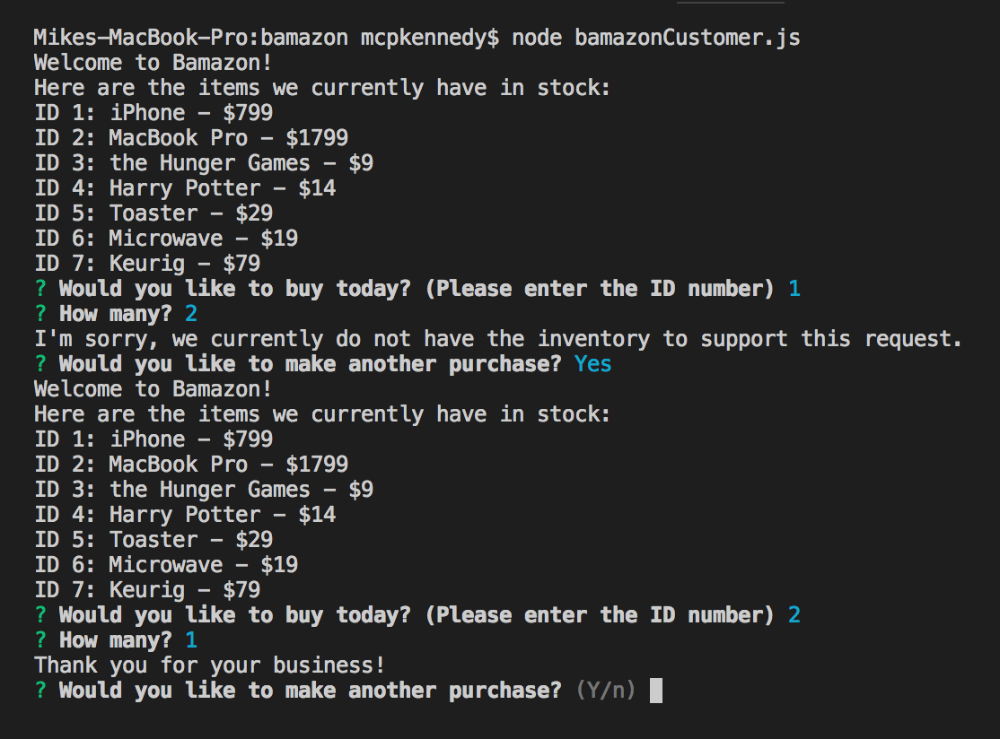
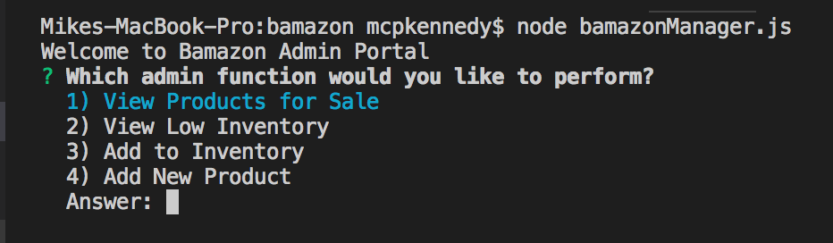
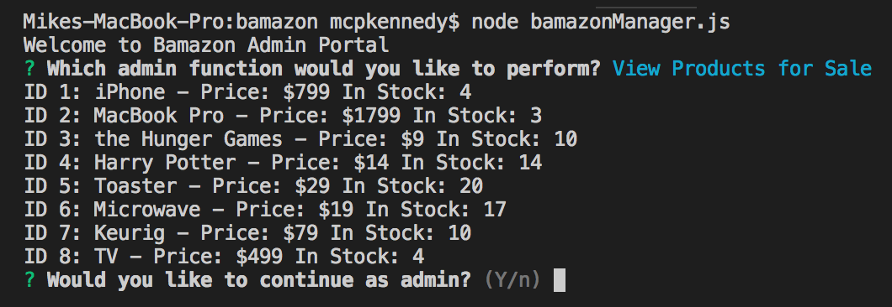
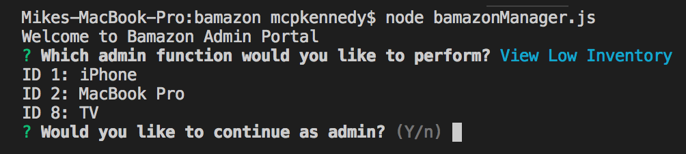
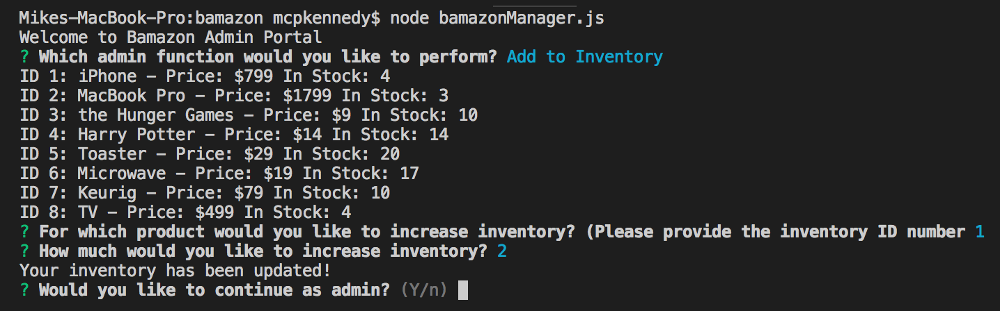
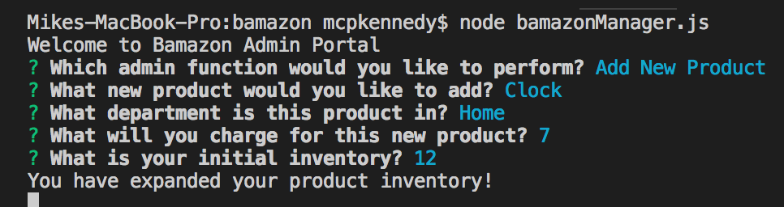

# bamazon

## What is bamazon?
Bamazon is an Amazon-like storefront. The CLI will take in orders from customers and deplete stock from the store's inventory.

## The Customer Portal
The customer portal that allows someone to select an item and how many of that item they want. This will then trigger a transaction, which will update the database. If there is not enough inventory, the transaction will not go through, and the user will be notified. See the screenshot below:

## The Manager Portal
The manager portal allows the manager to select from several admin functions:

- View Products:

- View Low Inventory:

- Add Inventory:

- Add a new product:

